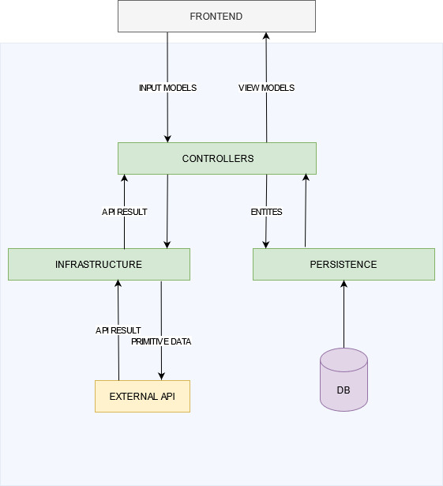

# Dotnet Project Boilerplate

This is a base project that helps you to implement new solutions using .NetCore Api's. The goal of this project is provide a inital solution that already handle the Restfull API requirements, implementing a complete user management system, logging, docker/kubernetes, scripts that can be used on Jenkis.

# Solution Architecture

A detailed explanation about responsabilities of each project layer

## Business

This layer should contain the intelligence of the system, here we should take decisions based on object states and invoke operations provided by other layers like "Repository", "Infrastructure.Mailing". 

You MUST write unit tests for all the methods of this layer, save special cases, but in general, all the methods that have some kind of intelligence or logic should be tested.

Probably the methods in this layer should be public, if you have the necessity to create a private method to handle some operation it could mean that you're handling more responsibility than is necessary for this layer. 
In this scenario, it's recommended to talk to you the project leader and to check what can be improved.

## Persistence

The repository layer is responsible for handle all operations of database communication such as SELECT, INSERT, DELETE, and invoke Storage procedures and views. 

CREATE and DROP tables,  indexes, synonyms or other DDL database operations should not be contemplated by this layer.

We're currently using Entity Framework Core as ORM to handle the database operations, please take care with excessive use of data that can be generated by the ORM, make sure that all of your selects just bring the necessary data, and avoid invoking operations that can spend more the 300ms

## Models

This layer contains all the objects types that could be used by the other project layers.

**Entities:** Object Types that are used to communicate with the database. Usually, the Entity Types should be declared as classes and make sure to receive in the constructor all the properties that are necessary to keep the object integrity. 

**InputModels:** Object Types that are used to represent the data that are received in the controller parameters, it's best practice to validate the object values using the data notations. The InputModels should be declared as records.

**ViewModels:** Object Types that are used to represent the data that will be used on the controller result. Often the ViewModels are created from Entity types. The ViewModels should be declared as records and you must to implement the logic to convert an Entity into a ViewModel inside as a static method on this object.

**Settings:** Object Types that represent the configurations defined into the application settings, the Settings type should be declared as Records.

## Setup

This layer contains all the configurations and links about classes and interfaces, here you need to the define the dependency injection rules and also load the configuration from application settings.

## Controllers

The application controllers.
Make sure that you're using the restful best practices and returning the correct HTTP Verbs for each kind of response. So, basically in this layer, you need to implement the intelligence to return a BadRequest, Success, NoContent and etc.. depending on the business results.

# Tests

The Unit test layer
